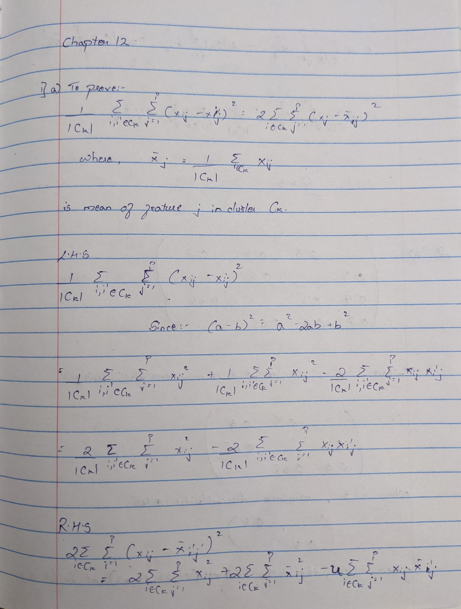
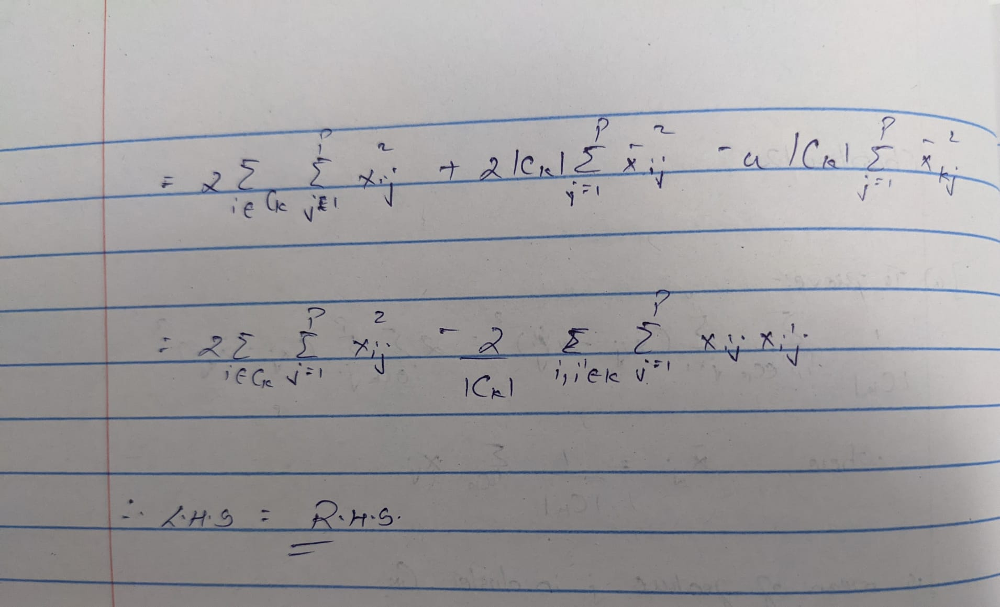

Name:- PARTH RATHOD
CWID:- A20458817
HW :- HW5
COURSE:- DPA CS571


Recitation
Question 1
a)
```{r}


```


b) 

In K-means clustering algorithm, at each iteration, an observation is assigned to its nearest cluster. Due to which
after each iteration the value of RHS will decreases as this quantity is sum of squared distance of each observation
from the cluster mean. Hence, in this way the k-means will decrease the objective in each iteration. 


Question 2
a)
```{r}

```

```{r}
dend = as.dist(matrix(c(0, 0.3, 0.4, 0.7, 
                     0.3, 0, 0.5, 0.8,
                     0.4, 0.5, 0.0, 0.45,
                     0.7, 0.8, 0.45, 0.0), nrow = 4))
plot(hclust(dend, method = "complete"))
```


b)
```{r}

```

```{r}
plot(hclust(dend, method = "single"))
```


c)
In this case, we have clusters (1,2) and (3,4).

d)
In this case, we have clusters ((1,2),3) and (4).

e)
```{r}
plot(hclust(dend, method = "complete"), labels = c(2,1,4,3))
```

Question 3
a)
```{r}
x <- cbind(c(1, 1, 0, 5, 6, 4), c(4, 3, 4, 1, 2, 0))
plot(x[,1], x[,2])
```

b)
```{r}
set.seed(1)
labels <- sample(2, nrow(x), replace = T)
labels

plot(x[, 1], x[, 2], col = (labels + 1), pch = 20, cex = 2)
```


c)
```{r}
centroid1 <- c(mean(x[labels == 1, 1]), mean(x[labels == 1, 2]))
centroid2 <- c(mean(x[labels == 2, 1]), mean(x[labels == 2, 2]))
plot(x[,1], x[,2], col=(labels + 1), pch = 20, cex = 2)
points(centroid1[1], centroid1[2], col = 2, pch = 4)
points(centroid2[1], centroid2[2], col = 3, pch = 4)

```


d)
```{r}
labels <- c(1, 1, 1, 2, 2, 2)
plot(x[, 1], x[, 2], col = (labels + 1), pch = 20, cex = 2)
points(centroid1[1], centroid1[2], col = 2, pch = 4)
points(centroid2[1], centroid2[2], col = 3, pch = 4)
```

e)
```{r}
centroid1 <- c(mean(x[labels == 1, 1]), mean(x[labels == 1, 2]))
centroid2 <- c(mean(x[labels == 2, 1]), mean(x[labels == 2, 2]))
plot(x[,1], x[,2], col=(labels + 1), pch = 20, cex = 2)
points(centroid1[1], centroid1[2], col = 2, pch = 4)
points(centroid2[1], centroid2[2], col = 3, pch = 4)
```


If we assign each observation to the centroid to which it is closest, nothing changes, so the algorithm is terminated at this step.

f)
```{r}
plot(x[, 1], x[, 2], col=(labels + 1), pch = 20, cex = 2)
```


Question 4

a)
There is not enough information to tell. For example, if d(1,4)=2, d(1,5)=3, d(2,4)=1, d(2,5)=3, d(3,4)=4 and d(3,5)=1, the single linkage dissimilarity between {1,2,3} and {4,5} would be equal to 1 and the complete linkage dissimilarity between {1,2,3} and {4,5} would be equal to 4. So, with single linkage, they would fuse at a height of 1, and with complete linkage, they would fuse at a height of 4. But, if all inter-observations distance are equal to 2, we would have that the single and complete linkage dissimilarities between {1,2,3} and {4,5} are equal to 2.


b)
They would fuse at the same height. For example, if d(5,6)=2, the single and complete linkage dissimilarities between {5} and {6} would be equal to 2. So, they would fuse at a height of 2 for single and complete linkage.


Practicum Problems

Problem 1

```{r}

URL <- "https://archive.ics.uci.edu/ml/machine-learning-databases/wine/wine.data"
data <- read.table(URL,sep=",")
colnames(data) <- c("class","alcohol","malic_acid","ash","alcalinity","magnesium","total_phenols","flavanoids",
                    "nonfalvanoid","roanthocyanins","color_intensity","hue","OD280/OD315","proline")
#display top six rows
head(data)

```

```{r}
print("Mean")
#check the means of predictors
apply(data[,-1],2,mean)

print("--------------------------------------------------------------------------------------------------------------")
print("Varaince")
#check the variance of the predictors
apply(data[,-1],2,var)

```

From the above mean and variance values it is clear that values are on different scale. So, we need to perform
scaling before applying PCA to our dataset.


```{r}
#using prcomp to perform PCA
output <- prcomp(data[,-1],scale=TRUE)
output$rotation
```


```{r}
#biplot
biplot(output,scale=0)
```


From the above plot we can see that feature malic_acid is pointed in opposite direction to the feature hue.

```{r}
library(corrplot)
M <- cor(data)
corrplot(M)
```

```{r}

cor(data$malic_acid,data$hue)
```
From the correlation value between feature hue and malic acid it is clear that as the one variable increases
the other variable decreases with the almost same extent.

```{r}
screeplot(output)
```

```{r}
summary(output)
```

```{r}
#calculating proportion of variance for each principle component
variance <- output$sdev^2
pve <- variance/sum(variance)
```

```{r}
#screenplot
par(mfrow=c(1,2))
plot(pve, xlab="Principal Component", ylab="Proportion of Variance Explained ",ylim=c(0,1),type='b')
plot(cumsum(pve), xlab="Principal Component ", ylab=" Cumulative Proportion of Variance Explained ",main="Screen Plot-2", ylim=c(0,1), type='b')

```


```{r}
#Proportion of variance expalined by PC1 and PC2
temp<-pve[1:2]*100
temp
sum(temp)
```

Thus, from the above results it is clear that PC1 and PC2 has explained total of 55.40% of variance.


Problem 2

```{r}
library("factoextra")
library(tidyverse)
```
```{r}
#load the dataset
data("USArrests")

#convert the dataset to a dataframe 
data <- data.frame(USArrests)
```

```{r}
print("Mean")
#checking the mean of the predictors
apply(data,2,mean)
print("-------------------------------------------------------------------------------------------------------")
print("Varaince")
#checking the variance of the predictors
apply(data,2,var)
```

In the above mean and variance values it is clear that values are on different scale. So, we need to perform scaling before applying k-means to our dataset. 


```{r}
#scaling the dataset
n_data <- scale(data, center = TRUE, scale = TRUE)
```


```{r}
#Applying K-Means
result <- function(k)
{
  kmeans(n_data,centers=k,nstart=20)$tot.withinss
}
# values of k form 2 to 10
k <- 2:10
```


```{r}
#compute total within-cluster sum of square values of k from 2 to 10
wss_val <- map_dbl(k, result)
wss_val
```

```{r}
#Using elbow method to find optimal K value
plot(k, wss_val,
     type="b", pch = 19, frame = FALSE, 
     xlab="Number of clusters K",
     ylab="Total within-clusters sum of squares")
```


```{r}
#another Method
fviz_nbclust(n_data, kmeans, method = "wss")
```


From the above two graph it is clear that if we consider major drop in total within-clusters sum of square values then the optimal value of k in this case will be 4.


```{r}
#plots
optimal <- kmeans(n_data, centers = 4, nstart = 20)
fviz_cluster(optimal, data = n_data)
```


Problem 3

```{r}
URL <- "https://archive.ics.uci.edu/ml/machine-learning-databases/wine-quality/winequality-white.csv"
wine <- read.csv(URL,sep=";")


#display dataset
head(wine)
```

```{r}
#exclude quality variable
dataset <- wine[,-12]

```


```{r}
print("Mean")
#check the mean 
apply(dataset,2,mean)


print("------------------------------------------------------------------------------------------------------")

print("Varaince")
#check the variance 
apply(dataset,2,var)
```

In the above mean and variance values it is clear that values are on different scale. So, we need to perform scaling
before applying hclust to our dataset. 


```{r}
#apply scaling
n_dataset <- scale(dataset,center = TRUE,scale=TRUE)

```


```{r}
#Performing hierarchical clustering using complete linkage
hc.complete <- hclust(dist(n_dataset),method="complete")
#dendogram of complete linkage
plot(hc.complete)

```


```{r}
#Performing hierarchical clustering using single linkage
hc.single <- hclust(dist(n_dataset),method="single")
#dendogram of single linkage
plot(hc.single)
```

```{r}
#for complete linkage
tail(hc.complete$height,1)

```

For complete linkage two penultimate clusters will merge at 27.73476

```{r}
#for single linkage
tail(hc.single$height,1)
```

For single linkage two penultimate clusters will merge at 14.25325


```{r}
#applying cutree method on complete linkage
cut.complete <- cutree(hc.complete,h=27.73476)
#Number of clusters formed
table(cut.complete)

```


```{r}
plot(hc.complete)
rect.hclust(hc.complete ,h=27.73476, border = 2:6)
abline(h =27.73476, col = 'red')
```


```{r}
#applying cutree method on single linkage
cut.single <- cutree(hc.single,h=14.25323)
#Number of clusters formed
table(cut.single)

```
```{r}
plot(hc.single)
rect.hclust(hc.single ,h=14.25323, border = 2:6)
abline(h =14.25323, col = 'red')
```


```{r}
#summary Statistics for complete linkage
dataset$Clusters <- cut.complete
unique(dataset$Clusters)

```
```{r}
dataset <- dplyr::group_by(dataset,Clusters)
a <- dplyr::summarise_each(dataset, funs(mean))

```

```{r}
#Difference in feature means for complete linkage
abs(a[2,-1]-a[1,-1])

```


```{r}
#summary Statistics for single linkage
dataset$Clusters <- cut.single
unique(dataset$Clusters)

```

```{r}
dataset <- dplyr::group_by(dataset,Clusters)
b <- dplyr::summarise_each(dataset, funs(mean))
```


```{r}
abs(b[2,-1]-b[1,-1])

```


From the above results we can see that feature residual.sugar has maximum means difference. Also, from the above
two plots of Complete and Single linkage we can conclude that Complete linkage produces more balanced clustering.
